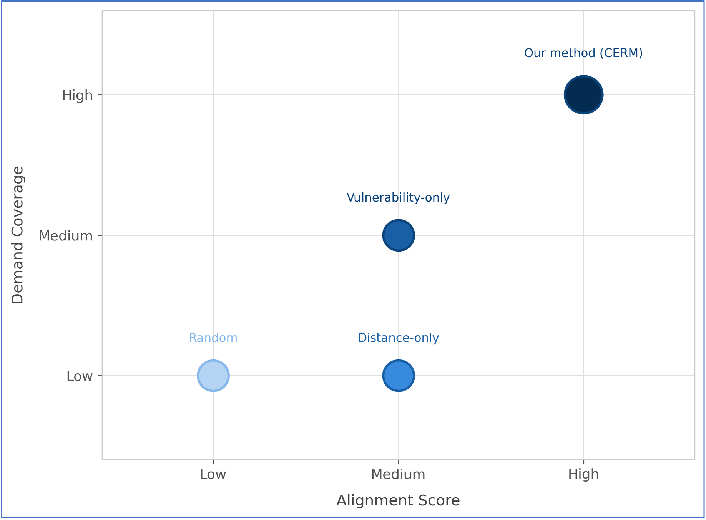

  

<h1 align="center">WiDS Datathon 2026 – Ramblin' Pathfinders</h1>
<h2 align="center">Community Evacuation Resource Matcher (CERM)</h2>

Click here to use tool: https://riyabharath24.github.io/cerm-wildfire-evacuation-tool/
---

### 🔹 Route 1: Accelerating Equitable Evacuations

**Core Question:**  
*How can we reduce delays in evacuation alerts and improve response times for the communities that are most at risk?*

This route focuses on analyzing how and when evacuation alerts are triggered — and how we can improve timeliness and fairness in communication, especially for vulnerable populations.

**Why this matters:**  
Improved risk dashboards, real-time alerts, and support systems for people with disabilities, pets, or other special needs.

---

## Project Title & Team Info

**Project Title**: Community Evacuation Resource Matcher (CERM)  
**Team Name**: Ramblin' Pathfinders  
**University**: Georgia Institute of Technology  
**Course**: N/A   
**Term**: Spring 2026  

**Team Members**:  
- Riya Bharathwaj
- Tingya Chang
- Saehee Eom
- Tanmayee Kolli
- Simran Mallik

------

# Abstract
Wildfires in California create urgent, high-stakes evacuation scenarios where timely and equitable access to support resources can significantly impact outcomes. However, existing tools primarily focus on fire prediction and monitoring, rather than enabling real-time, community-level coordination of assistance.

In this project, we present a **community-driven evacuation support system** that connects individuals offering help with neighborhoods in need, using a combination of demographic vulnerability data, real-time request signals, and geographic proximity. Our approach integrates **rule-based matching with lightweight LLM-assisted categorization** to recommend high-priority census tracts where assistance is most needed.

Unlike fully automated systems, our solution emphasizes **decision support rather than control**, enabling users to make informed choices while ensuring privacy and avoiding misuse in high-risk active fire zones.

# 1. Introduction
Wildfire evacuations disproportionately impact vulnerable populations, including:
- elderly residents, 
- people with disabilities, 
- and households without vehicle access. 

These groups often face **structural barriers to evacuation**, such as limited mobility, lack of transportation, or reduced access to timely information.

While critical tools such as fire perimeter tracking and evacuation alerts provide situational awareness, they do not address a fundamental coordination gap: how can communities **organize in real time to help vulnerable residents evacuate?** 

This project directly addresses that question by designing a system that:
- surfaces **where help is most needed**, and 
- enables individuals and community groups to **self-organize and provide assistance**.

The system is designed for **in-the-moment use** and includes safeguards to ensure it is **not used in active emergency zones**, where emergency services (e.g., 911) and immediate evacuation are more appropriate.

# 2. Data Analysis
The system draws on three primary data sources:

## Fire Perimeter Data
Historical records on fire perimeter are sourced from **Watch Duty** and **CalFire**. This data was used to determine which census tracts are affected by wildfire and are used to enforce the system's safety constraint (see Section 3.4).

## Demographic Vulnerability Data
Census tract-level demographic data from the **American Community Survey** and the **US Census Bureau** captures three indicators of structural evacuation vulnerability:
- Percentage of residents aged 65 or older
- Percentage of residents with disabilities
- Percentage of households without vehicle access

Counties with at least 50 census tracts and meaningful variation in at least one demographic dimension (elderly %, disability %, or car-free households) were selected for analysis. The tract count requirement ensures the county has enough geographic granularity to meaningfully distinguish high-need areas from typical ones. The variation requirement ensures the county has real demographic heterogeneity. Without it, all tracts look alike and resource prioritization across the county becomes uninformative.

Our prototype development focused on three counties with elevated wildfire risk: **Butte, Shasta, and Riverside**.

## Request Data (Prototype)
User-submitted and simulated requests capture unmet needs such as transportation, medical assistance, and supplies. 

These are aggregated at the census tract level to produce two signals: 

- the volume of active requests and 
- the categories of need that remain unresolved.

# 3. System Design and Methodology
The system consists of three components: a user input layer, an LLM-based categorization pipeline, and a matching engine.

## 3.1 User Input Layer
Two types of users interact with the system. 

**Requesters**
- submit free-text descriptions of their needs and 
- can view aggregate demand across census tracts.

**Helpers**
- submit descriptions of the resources or services they can offer and 
- receive ranked recommendations for where to direct their assistance.

## 3.2 LLM-Based Categorization
A large language model (DeepSeek-V3-0324) converts free-text into structured, machine-readable tags. **The LLM is used exclusively for categorization (not decision-making) which limits hallucination risk and preserves interpretability.**
 
The model is prompted to extract three tag categories:
- **Service tags**: transportation, mobility assistance, heavy lifting, medical, food distribution, volunteer labor, childcare
- **Resource tags**: water, food, medicine, clothing, fuel, equipment, tools, first aid
- **Beneficiary tags**: elderly, disability, no vehicle, families, children, general

The prompt instructs the model to return only valid JSON with no additional explanation, ensuring consistent structured output for downstream matching.

## 3.3 Matching Engine
Each census tract is scored against a helper's input using four weighted components:

**Final Score**

*Score = 0.25 * vFit + 0.15 * rVol + 0.25 * reqMatch + 0.35 * prox*

Ranks tracts and displays the top recommendations to the helper. Proximity carries the highest weight to minimize travel time under emergency conditions.

## 3.4 Fire-Aware Safety Constraint
To prevent misuse, census tracts currently within active fire perimeters are excluded from matching entirely. 

Users located in these areas are redirected to emergency services and immediate evacuation guidance rather than community coordination features.

## 3.5 Community Coordination Mechanism
Users can mark when they are providing help and when requests have been fulfilled, allowing demand signals to update dynamically. 

The system **does not enforce allocation**, but provides recommendations while users retain full decision-making control.

## 3.6 Privacy Protection
Privacy is protected by design. In the current prototype:

- **Requesters**: see only the total number of open requests per census tract, and no details of individual requests
- **Helpers**: see a request's address (all addresses in the prototype are simulated using non-residential locations) but no personal contact information

Future versions of the system will strengthen these protections further:
- Before a match is made, helpers will see only a rough area, not a precise address
- Full address and contact details will only be revealed once both sides have agreed to connect
- User identity authentication will be introduced to add another layer of trust and accountability

## 3.7 Technical Implementation

**Frontend**

The frontend is a single-page application built with HTML, CSS, and JavaScript, using Leaflet.js for interactive mapping and hosted on GitHub Pages. 

**Backend**

The backend is a Python data pipeline (pandas, geopandas) handling census data cleaning and spatial processing. LLM calls are proxied through a Vercel serverless function.

# 4. Evaluation and Performance Metrics
## 4.1. Metrics

Due to the absence of real-time ground-truth evacuation outcomes, we propose **five performance metrics and two adoption metrics** to evaluate the effectiveness of our system. The performance metrics focus on how well the platform supports evacuation coordination and resource matching during wildfire events, while the adoption metrics evaluate real-world usage and growth from a deployment perspective.

### 4.1.1. Performance Metrics
**a. Evacuation Efficiency**

Measures the improvement in evacuation time relative to historical baselines.

$$\frac{\text{Avg. Evacuation Time Difference}}{\text{Avg. Evacuation Time Before Deployment}} \times 100$$

This metric estimates how much evacuation time could be reduced through improved coordination and faster resource allocation enabled by the platform.

**b. Request Alignment Score**

$$\frac{\text{Helpers assigned to tracts with category-matched requests}}{\text{Total helpers assigned to tracts with requests}} \times 100$$

Evaluates how effectively the matching engine assigns helpers to locations where their offered resources directly correspond to the needs expressed by residents.

**c. Demand Coverage**
$$\frac{\text{Requests resolved within T hours}}{\text{Total distinct requests submitted within T hours}} \times 100$$

Measures the proportion of requests that are successfully addressed within a given time window, indicating how well the system mobilizes community resources during an emergency.

**d. Vulnerable Group Demand Coverage**
Demand Coverage calculated separately for each vulnerable demographic group:
- Elderly residents
- People with disabilities
- Households without vehicles
This metric ensures that support reaches the populations most likely to face evacuation barriers.

**e. Mean Accepted Recommendation Rank**
Average rank of the census tracts that helpers ultimately choose after receiving recommendations from the system. Ideally, this value should be close to 1, meaning users frequently accept the highest-ranked recommendations. Higher values may indicate that the recommendation algorithm is less aligned with user decisions.

### 4.1.2 Adoption Metrics
**a. User Signups**

Number of registered users on the platform and quarter-over-quarter (QoQ) growth. This metric reflects overall community engagement and the scalability of the platform.

**b. Active Users During Fire Events**

Number of users who actively utilize the platform during a wildfire incident. This metric captures real-world relevance and indicates whether the system is being used when it matters most, during active emergencies.

## 4.2. Performance Insights

CERM takes distance and vulnerability of demographics of areas into account, beating the other single-factor methods or random matching baseline.

From simulation and early testing:
- Strong performance in high-engagement areas with sufficient volunteer supply
- Performance decreases in areas with:
   - Low volunteer density
   - Highly variable or complex needs 

# 5. Conclusion and Impact
This project demonstrates how a lightweight, interpretable system can support **real-time**, **community-driven evacuation assistance** during wildfire events. 

By combining demographic vulnerability signals, live request data, and geographic proximity within a transparent scoring framework, the system **bridges the gap between fire awareness tools and on-the-ground community coordination**.

The system has the potential to:
- improve evacuation support access for vulnerable populations, 
- enable faster decentralized response through community self-organization, and 
- provide meaningful decision support under time pressure, without over-automating choices that carry real human stakes.

## Limitations
- Reliance on aggregated census data with no household-level precision
- Simulated request data in the prototype; no real-world validation yet
- Static scoring weights not tuned to specific disaster contexts
- No real-time fire spread modeling
- LLM misclassification risk, particularly for ambiguous or informal language

## Future Work
- Integration with real-time shelter and emergency data (Cal OES, Red Cross)
- Expansion to additional counties and states
- Incorporation of road accessibility and geographic isolation features
- Retrospective evaluation using historical evacuation scenarios
- Dynamic weight tuning based on real-world feedback

# References

[1] Melton, C. C., et al. (2023). Wildfires and older adults: A scoping review of impacts, risks, and interventions. International Journal of Environmental Research and Public Health.

[2] Rad, A. M., et al. (2023). Social vulnerability of populations exposed to wildfires in the United States. 

[3] Matsuo, Y. (2025). Evacuation and transportation barriers among vulnerable populations in disasters. 

[4] UCLA Institute of Transportation Studies. (2025). Wildfire recovery and resilience strategies for vulnerable communities.

[5] Sun, Y., et al. (2024). Social vulnerabilities and wildfire evacuations: A case study of the 2019 Kincade Fire.

[6] FEMA. (2011). A Whole Community Approach to Emergency Management: Principles, Themes, and Pathways for Action.

[7] National Academies of Sciences, Engineering, and Medicine. (2019). Evacuation Decision Making in Disasters.

[8] Aldrich, D. P., & Meyer, M. A. (2015). Social capital and community resilience. American Behavioral Scientist.

## Team Contributions

| Name             | Contributions                                                                  |
|------------------|--------------------------------------------------------------------------------|
| Riya Bharathwaj  | EDA, Feature engineering, modeling, building solution, presentation prep       |
| Ting-ya Chang    | EDA, geospatial joins, Research/Outreach, building solution, presentation prep |
| Saehee Eom       | EDA, Feature engineering, modeling, building solution, presentation prep       |
| Tanmayee Kolli   | EDA, Research/Outreach, building solution, presentation prep                   |
| Simran Mallik    | EDA, preprocessing, Research/Outreach, building solution, presentation prep    |

